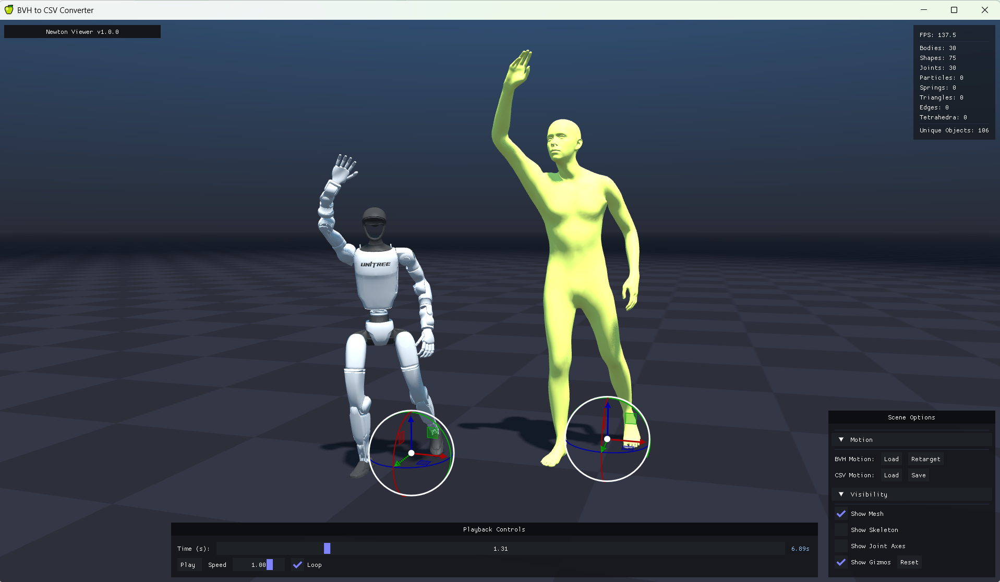

# SOMA Retargeter
[](https://opensource.org/licenses/Apache-2.0)


Convert [SOMA](https://github.com/NVlabs/SOMA-X) human motion captures into humanoid robot joint animation. Takes BVH motion files as input and produces robot-playable CSV joint data as output using GPU-optimized inverse kinematics via [Newton](https://github.com/newton-physics/newton) and high-performance computation with [NVIDIA Warp](https://github.com/NVIDIA/warp).

The retargeting pipeline handles proportional human-to-robot scaling, multi-objective IK solving with joint limits, feet stabilization to maintain ground contact, and per-DOF joint limit clamping. Currently supports SOMA as the input skeleton and Unitree G1 (29 DOF) as the output robot. Additional robot targets are planned.

SOMA Retargeter is part of the [SOMA body model](https://github.com/NVlabs/SOMA-X) ecosystem for humanoid motion data.

> **Note:** This project is in active development. The API may change between releases as the design is refined.

## Requirements

- **Python:** 3.12
- **Git LFS:** Installed and initialized for asset downloads
- **OS:** Windows (x86-64) and Linux (x86-64, aarch64)
- **GPU:** NVIDIA GPU (Maxwell or newer), driver 545+ (CUDA 12). No local CUDA Toolkit installation required.

## Installation

<details>

<summary>Setup instructions</summary>

### Method 1 (conda + pip)

#### 1. Create and Activate Conda Environment

```bash
conda create -n soma-retargeter python=3.12 -y
conda activate soma-retargeter
```

#### 2. Download LFS Assets

```bash
git lfs pull
```

#### 3. Install the Library

```bash
pip install .
```

### Method 2 (uv)

#### 1. Install uv

Follow the [official installation guide](https://docs.astral.sh/uv/getting-started/installation/) if `uv` is not yet installed.

#### 2. Download LFS Assets

```bash
git lfs pull
```

#### 3. Sync the Project

`uv sync` creates an isolated `.venv` virtual environment inside the project directory, installs the correct Python version and resolves all dependencies.

```bash
uv sync
```

### Platform-specific notes

**Note (Linux):** For the GUI viewer to work, install `tkinter`

```bash
sudo apt-get install python3.12-tk
```

**Note (Windows):** If `imgui-bundle` fails to install, the Microsoft Visual C++ Redistributables may be missing. Download from the [official Microsoft documentation](https://learn.microsoft.com/en-us/cpp/windows/latest-supported-vc-redist).

</details>

## Motion Data

This repo includes 10 sample BVH/CSV pairs in `assets/motions/` for immediate testing.

For large-scale motion data, see the [SEED dataset](https://huggingface.co/datasets/bones-studio/seed) (Skeletal Everyday Embodiment Dataset) published by [Bones Studio](https://huggingface.co/bones-studio). SEED provides a large-scale collection of human motions on the SOMA uniform-proportion skeleton, which is the expected input format for this tool. The G1 robot motion data included in SEED was retargeted using SOMA Retargeter.

## Quick Start

> When using **uv** (Method 2), replace `python` with `uv run` in the commands below.

### Interactive viewer (OpenGL)

```bash
python ./app/bvh_to_csv_converter.py --config ./assets/default_bvh_to_csv_converter_config.json --viewer gl
python ./app/bvh_to_csv_converter.py   --config ./assets/pm01_bvh_to_csv_converter_config.json   --viewer gl
python ./app/bvh_to_csv_converter.py   --config ./assets/pi_plus_bvh_to_csv_converter_config.json   --viewer gl
python ./app/bvh_to_csv_converter.py   --config ./assets/adam_lite_bvh_to_csv_converter_config.json   --viewer gl


```



The viewer displays the source SOMA motion alongside the retargeted robot in a 3D viewport. Use the right panel to load BVH files, run retargeting, and save CSV output. Playback controls at the bottom allow scrubbing, speed adjustment, and looping. Toggle visibility of the skinned mesh, skeleton, joint axes, and positioning gizmos.

### Batch conversion (headless)

Process a folder of BVH files without a display. Set `import_folder` and `export_folder` in the config file, then run:

```bash
python ./app/bvh_to_csv_converter.py --config ./assets/default_bvh_to_csv_converter_config.json --viewer null
```

Batch mode recursively finds all `.bvh` files in the import folder, processes them in configurable batch sizes, and writes CSV files to the export folder mirroring the input directory structure.

## Code Overview

### `app/`

| File | Description |
|------|-------------|
| `bvh_to_csv_converter.py` | Main entry point. Drives both interactive and headless batch retargeting modes. |

### `soma_retargeter/`

| Module | Description |
|--------|-------------|
| `animation/` | Core data structures for skeletons, animation buffers, IK, and skinned meshes. |
| `assets/` | File I/O for BVH, CSV, and USD formats. |
| `pipelines/` | Retargeting pipeline: IK solving, feet stabilization, and joint limit clamping. |
| `robotics/` | Human-to-robot scaling and robot output formatting. |
| `renderers/` | Visualization for the interactive viewer. |
| `utils/` | Math, pose, coordinate conversion, Newton and Warp helpers. |
| `configs/` | JSON configuration for retargeting, scaling, and feet stabilization parameters. |

## Related Work

SOMA Retargeter is a support tool within the SOMA ecosystem for humanoid motion data:

* [SOMA Body Model](https://github.com/NVlabs/SOMA-X) - Parametric human body model with standardized skeleton, mesh, and shape parameters
* [GEM-X](https://github.com/NVlabs/GEM-X) - Human motion estimation from video
* [Kimodo](https://github.com/nv-tlabs/kimodo) - Kinematic motion diffusion model for text and constraint-driven 3D human and robot motion generation
* [ProtoMotions](https://github.com/NVlabs/ProtoMotions) - GPU-accelerated simulation and learning framework for training physically simulated digital humans and humanoid robots
* [SONIC](https://nvlabs.github.io/GEAR-SONIC/) - Whole-body control for humanoid robots, training locomotion and interaction policies

## Acknowledgments

This project draws inspiration and builds upon excellent open-source work, including:
* [GMR](https://github.com/YanjieZe/GMR) - General Motion Retargeting
* [PyRoki](https://pyroki-toolkit.github.io/) - A Modular Toolkit for Robot Kinematic Optimization

## License

This codebase is licensed under [Apache-2.0](LICENSE).

This project will download and install additional third-party open source software projects. Review the license terms of these open source projects before use.


一、环境配置（只需做一次）
# 1. 清理掉之前那个空壳（如果你那个 (soma-retargeter) 提示还残留就跑这步）
rm -rf /home/wayne/miniconda3/envs/soma-retargeter
# 2. 创建干净的 Python 3.12 环境
conda create -n soma-retargeter python=3.12 -y
# 3. 激活环境
conda activate soma-retargeter
# 4. 进项目目录
cd /home/wayne/soma-retargeter
# 5. 拉 LFS 大文件（BVH 样例 + USD mesh）
git lfs install --local
git lfs pull
# 6. 安装项目（必须带 NVIDIA 的 pypi index，warp-lang 1.12.0 只在那有）
pip install --extra-index-url https://pypi.nvidia.com .
# 7.（可选）GUI 文件对话框需要 tkinter；conda 的 python 3.12 一般自带，没有再装
sudo apt-get install -y python3.12-tk
验证安装
python -c "import newton, warp, soma_retargeter; print('newton', newton.__version__, '| warp', warp.__version__, '| OK')"
预期输出（首次会触发 Warp 初始化日志，能看到 cuda:0 NVIDIA GeForce RTX 5070 Laptop GPU 就对了）：

newton 1.0.0 | warp 1.12.0 | OK
二、日常运行
每次开新终端时，先激活环境：

conda activate soma-retargeter
cd /home/wayne/soma-retargeter-plus
然后选一个跑法：

1) 交互式 GUI（OpenGL viewer）
python ./app/bvh_to_csv_converter.py \
  --config ./assets/default_bvh_to_csv_converter_config.json \
  --viewer gl
GUI 里：右下角面板 Load 选一个 .bvh → Retarget → CSV 那行 Save 导出。

2) 批量无头处理（headless）
先编辑 assets/default_bvh_to_csv_converter_config.json 里的 import_folder / export_folder，再跑：

python ./app/bvh_to_csv_converter.py \
  --config ./assets/default_bvh_to_csv_converter_config.json \
  --viewer null

支持的机器人（assets/<robot>_bvh_to_csv_converter_config.json 里 retarget_target 字段）：

| Robot string | Source folder | Notes |
|---|---|---|
| `unitree_g1` | `assets/robots/unitree_g1/` | 29 DOF, Newton built-in fallback |
| `engineai_pm01` | `assets/robots/engineai_pm01/` | 24 DOF (含头部 yaw)，已校准 |
| `hightorque_pi_plus` | `assets/robots/hightorque_pi_plus/` | 20 DOF 小型人形，placeholder offsets，需要 GUI 校准 |
| `pndbotics_adam_lite` | `assets/robots/pndbotics_adam_lite/` | 25 DOF 全尺寸人形，placeholder offsets，需要 GUI 校准 |

新机器人的 bias 校准流程：先用 GUI 进 Calibrate Mode 调零位姿/yaw，"Compute Scales" → "Write scales to Config" → "Compute Offsets" → "Write offsets to Config"。CLI 等价命令：`python tools/calibrate_robot_offsets.py <robot> --scales --calc-pos --write`。
3) 单文件 + 自定义 BVH 骨骼（SFU/CMU 风格）
仓库里已有的脚本：

python ./scripts/retarget_sfu_bvh.py path/to/your.bvh \
  -o path/to/output.csv \
  --height 1.75
--height 是演员身高（米），用于 human→robot 的整体缩放。

 